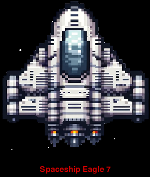
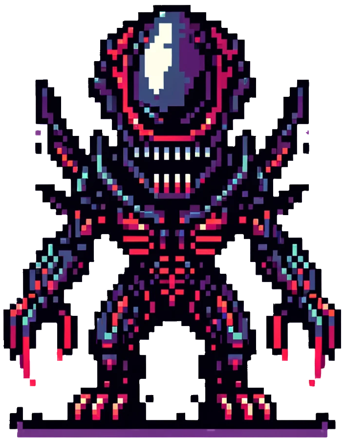
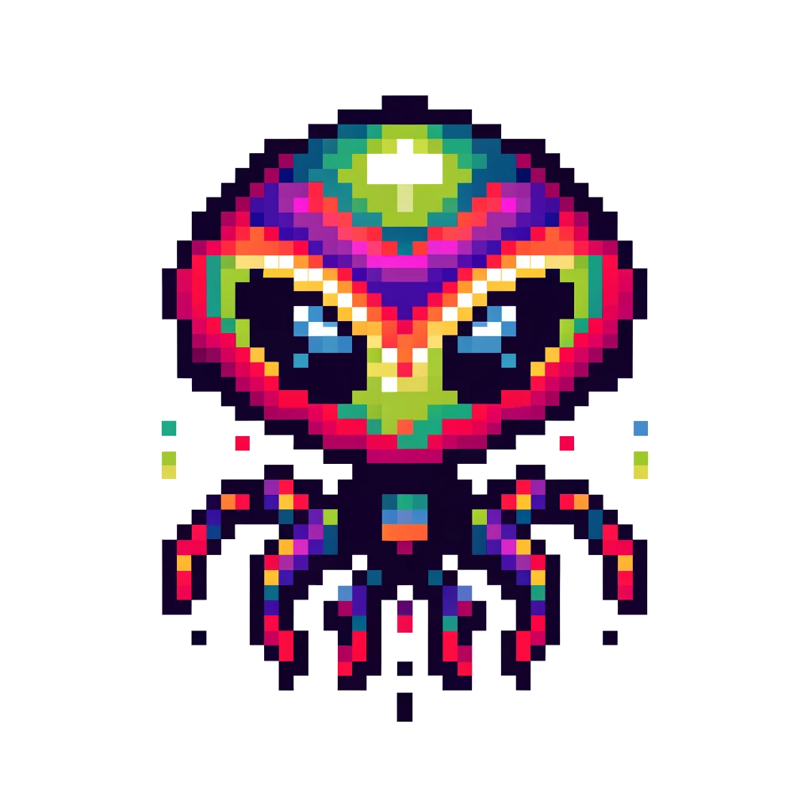
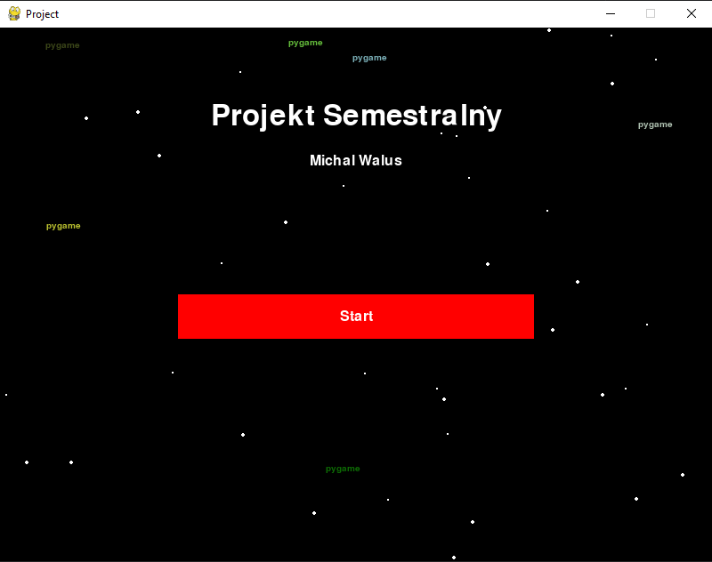
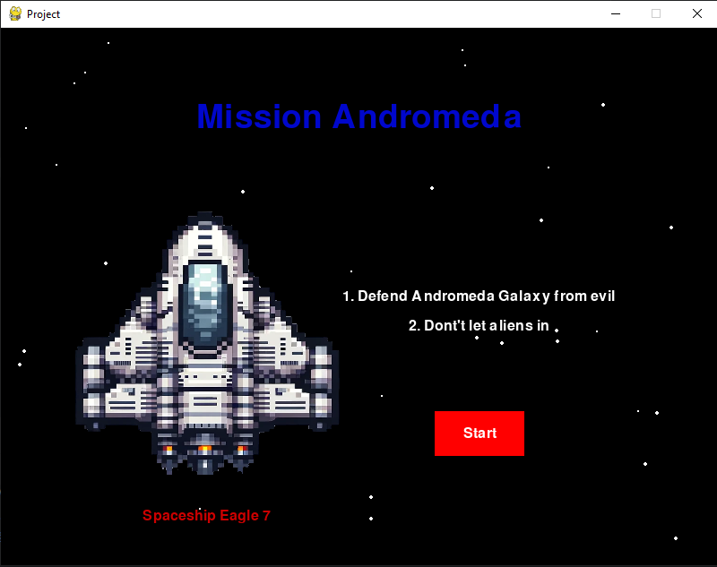
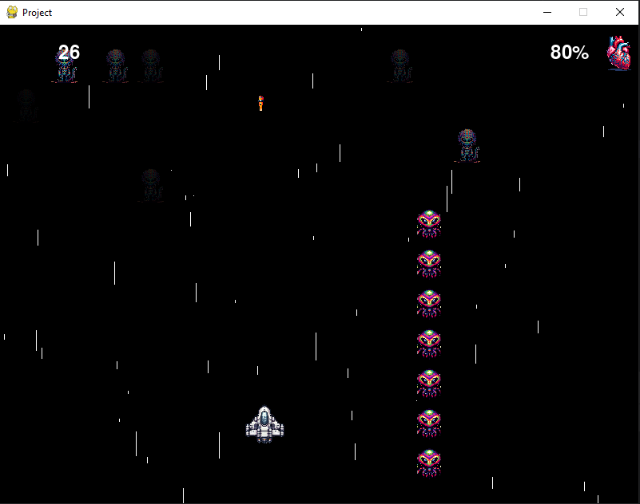
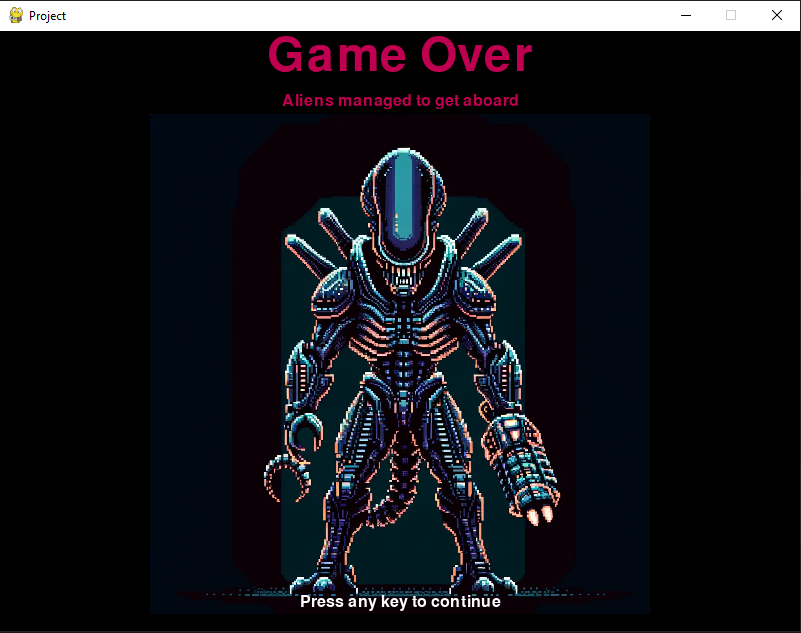
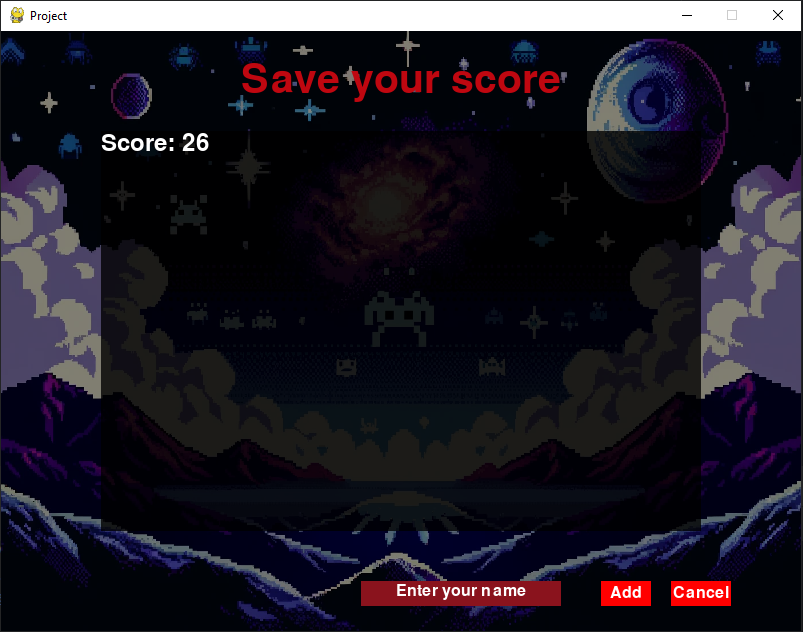
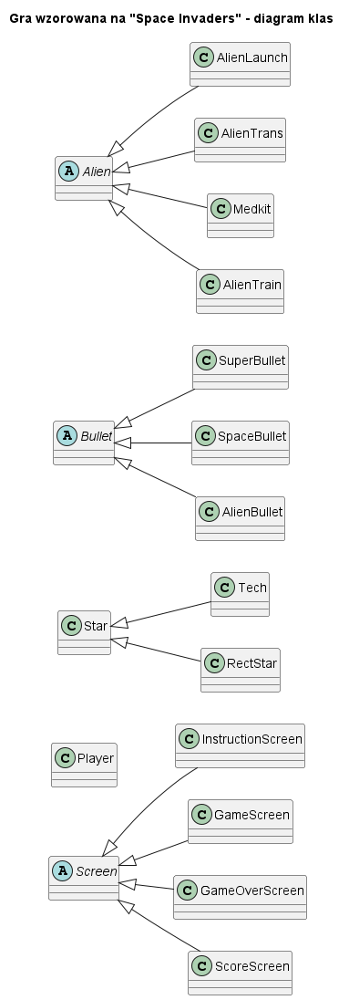

# Gra wzorowana na “Space Invaders”
  Michał Waluś (mw306757@student.polsl.pl)

## Ogólny opis działania gry
Centrum programu będzie stanowiła gra, w której statek kosmiczny porusza się tak jak myszka użytkownika. Statek przy kliknięciu lewego przycisku myszki strzela pociskami do kosmitów, których zniszczenie jest celem gracza. Kosmici mają różne warianty i różne zachowania. Gracz przegrywa gdy straci wszystkie życia. Za każdym razem, gdy kosmita zrani gracza odejmowane jest 10% życia. Użytkownik na koniec jest w stanie zapisać swój wynik wraz z nazwą użytkownika i wyświetlić ranking wyników. Jego nazwa użytkownika będzie weryfikowana pod kątem zgodności ze wzornikiem.

## Rozgrywka
Gracz steruje myszką statkiem kosmicznym, statek podąża za kursorem i zmienia swoją współrzędną “x”, lecz współrzędna “y” pozostaje stała. Statek nie jest w stanie wylecieć poza okno gdy kursor za bardzo się wychyli. Kosmici pojawiają się na ekranie losowo, nie ma żadnej zasady pozwalającej ustalić ile oraz w którym momencie się pojawią. Zderzenie z kosmitą lub jego pociskiem zabiera graczowi 10% punktów życia. Gra kończy się gdy użytkownik straci całe życie. Oprócz strzelania zwykłymi pociskami jest możliwy wystrzał “Super pocisku”, który odejmuje 50 punktów z wyniku końcowego gracza ale jest większy, szybszy i nie znika po trafieniu przeciwnika w porównaniu do zwykłego pocisku.

## Sterowanie

<procedure title="Ruch statkiem" id="inject-a-procedure">
    <step>
        
Za pomocą myszki użytkownik porusza się statkiem po planszy.

        
    </step>
    <step>
           
Strzelanie zwykłymi pociskami odbywa się za pomocą <shortcut>Lewy przycisk myszki</shortcut>

    </step>
    <step>
        
Gracz może nacisnąć klawisz <shortcut>Spacja</shortcut> żeby wystrzelić super-rakietę

    </step>
</procedure>

## Kosmici

### kosmita szarżujący na gracza

{ width=150 }
Kosmita ten widząc statek zaczyna poruszać się w jego kierunku, pojawia się zawsze u szczytu planszy ale jego konkretne miejsce na osi horyzontalnej jest losowe.

### znikający kosmita
{ width=150 }
Pojawia się zawsze w górnej części ekranu i podąża z lewej do prawej, gdy zetknie się z krawędzią przybliża się do gracza o stałą wartość pikseli. Płynnie zwiększa on swoją widoczność a następnie płynnie rozpływa się na tle ekranu. Jego główna mechanika polega na tym, że gracz musi go zniszczyć gdy jest słabo widoczny (przewidzieć jego miejsce pobytu) inaczej w chwili zniszczenia wystrzeli on pocisk kosmicznej energii.

### kosmiczny pociąg
{ width=150 }
Bardzo niebezpieczna formacja 20 kosmitów przemieszczająca się w kolumnie. Pociąg jest bardzo szybki a zderzenie z dowolną jego składową (1 z 20) skutkuje straceniem 10% życia. Gracz jest w stanie przewidzieć nadjeżdżający pociąg, ponieważ na torze jego lotu pojawi się czerwona trasa.

## Zdarzenia losowe

### Apteczka
{ width=150 }
W dosyć rzadkim przypadku (1 cykl pętli na 1000) na mapie może pojawić się apteczka. Gracz może zregenerować nią 10% punktów życia jeżeli uda mu się ją zestrzelić lub najechać na nią statkiem.

## Interfejs programu

### Ekran z tytułem projektu
{ width=400 }

### Ekran z instrukcjami dla gracza
{ width=400 }

### Ekran z właściwą rozgrywką
{ width=400 }

### Ekran informujący o przegranej
{ width=400 }

### Ekran z rankingiem
{ width=400 }

## Informacje techniczne
<procedure title="Przebieg programu" id="inject-a-procedure1">
    <step>
        
strona tytułowa, zawiera informacje o twórcy i samym projekcie

    </step>
    <step>
           
strona z instrukcjami, wyjaśnia zasady gry i wprowadza użytkownika w mechaniki

    </step>
     <step>
           
właściwa gra aż użytkownik nie straci całego życia

    </step>
    <step>
           
ekran z informacją o przegranej

    </step>
    <step>
           
możliwość zapisania swojego wyniku i wyświetlenie rankingu graczy

    </step>
</procedure>

### Techniki obiektowe
Realizacja polimorfizmu odbędzie się za pomocą klas dotyczących kosmitów (AlienLaunch, AlienTrans, AlienTrain).

Każdy wyświetlany ekran dziedziczy po klasie Screen. Klasa Bullet ma trzy klasy potomne.

<procedure title="Biblioteki dołączone w celu rozszerzenia funkcjonalności" id="inject-a-procedure2">
    <step>
        
<strong>pygame</strong>: najważniejsza biblioteka projektu, pozwala zaimplementować system wyświetlania, kolizji

    </step>
    <step>
           
<strong>vlc</strong>: pozwala w łatwy sposób odtworzyć muzykę pobraną do pliku
               <strong>pytube</strong>: pobiera muzykę z serwisu YouTube (muzyka jest usuwana pod koniec działania programu)

    </step>
     <step>
           
<strong>pathlib</strong>: biblioteka do manipulacji plikami

    </step>
    <step>
           
<strong>threading</strong>: tworzenie wątków

    </step>
    <step>
           
<strong>re</strong>: pozwala zweryfikować nazwę użytkownika za pomocą wyrażeń regularnych

    </step>
</procedure>

### Struktury danych
Zadecydowano, że najlepszym rozwiązaniem będzie zastosowanie Python Lists ze względu na ich uniwersalność i dosyć dobrą wydajność.

### Diagram najważniejszych klas
{ width=400 }